# Chess Review Open 3.0 · Interactive Chess Review

[Chinese edition](https://github.com/kevina0817-ctrl/chess-review-skill)

## Purpose

Give your latest game (PGN) to an AI coding assistant and get an **interactive review you can open in your browser**: see where things went wrong, compare a better move, and try it yourself on the board. English explanations, offline access, no website account required.

Works with Codex, Claude Code, Kimi and other assistants that support the Agent Skills (`SKILL.md`) format.

## Changelog

| Version | New feature | What you can do |
|---|---|---|
| 3.0 | Both sides and game data | Learn from your own and your opponent’s good moves and mistakes. Explore reference scores, phase breakdowns, a clickable evaluation chart and a position-linked advantage bar. |
| 3.0 | Threat exploration | Replay engine continuations from key positions, with checks, captures and checkmate marked. |
| 3.0 | Opening recognition and study | Identify the opening from actual positions, see its name and ECO code, and follow opening study links. |
| 2.0 | Automatic Chess.com import | Share your username, then simply ask for your latest game. No copy/paste or password needed. PGN from other platforms still works. |
| 2.0 | Common leaks across games | After at least 10 distinct completed reviews, opt into recurring-mistake analysis. New reviews add examples and evidence of progress. |

The plugin contains two skills: **`chess-review-open-en`** for individual games and **`chess-common-leaks-en`** for recurring mistakes and progress.

## Quick Installation

Open a conversation in **Codex or your coding agent’s desktop app** and paste:

```text
Install the Chess Review English plugin and both skills from this repository, and set up the required dependencies: https://github.com/kevina0817-ctrl/chess-review-skill-en
```

Once installed, tell your assistant your Chess.com username and ask for a review. If you already have an earlier version, ask the agent to update the skill.

## How to use it

1. **Share your username.** “My Chess.com username is YOUR_USERNAME. Review my latest game.” The assistant remembers it locally and checks your color separately for each game.
2. **Just ask.** Ask the agent to review a game—for example, “Review my last game.” By default, it reviews your latest completed game. You can also ask for several recent games or specify a particular game by date, opponent or game link. For other platforms, paste PGN and say which side you played.
3. **Open your review.** Each game is saved as `chess-reviews/DATE_Opponent.html`, with an `index.html` containing your archive.
4. **Find recurring mistakes.** After at least 10 completed reviews, ask “Analyze my common leaks.” Once enabled, new reviews update the archive automatically.

If the requested game is already reviewed, the assistant returns the existing record. Chess.com’s public archives can lag; missing new games are reported honestly.

## Features

### 1. Game review

Select a section to expand its explanation and screenshots; select it again to collapse.

<details>
<summary><strong>Both sides, scores and evaluation chart</strong></summary>

**Learn from both sides, with data linked to the board.** Explore your own and your opponent’s key moves, strengths and mistakes. Click the chart to revisit actual play; the advantage bar follows the current analyzed position.

**Scores with a clear meaning.** See both sides’ move-quality reference scores, your opening/middlegame/endgame breakdown and sample counts. These are not Elo or another platform’s whole-game accuracy. The calculation is explained on the page.

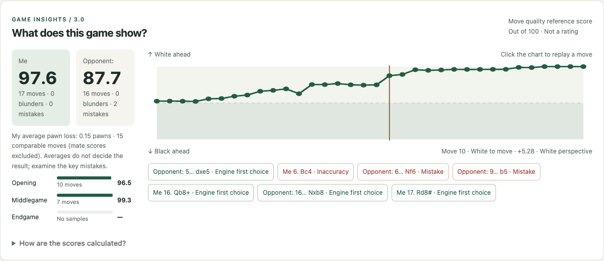

</details>

<details>
<summary><strong>Threats and engine continuations</strong></summary>

**Understand the continuation.** Engine examples mark checks, captures and verified checkmate. Suggested lines are always separate from the actual game.

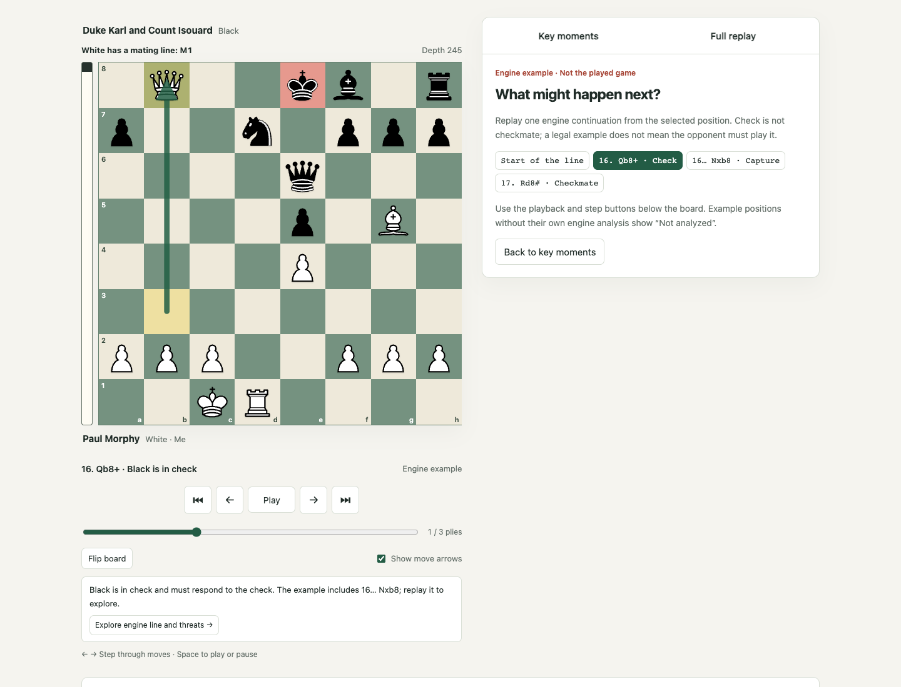

</details>

<details>
<summary><strong>Opening recognition and study</strong></summary>

**Opening recognition and study: learn from a position you actually played.** Expand “Learn this opening” to see the matched name, ECO code and opening moves.

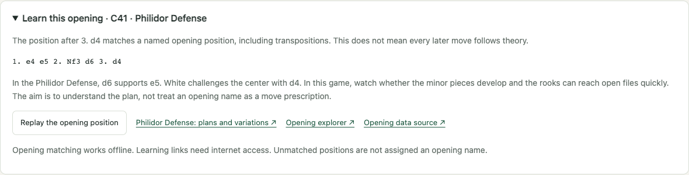

This example identifies **C41 · Philidor Defense** and explains the idea of supporting e5 with d6 while White challenges the center with d4. Jump back to the opening position on the board, then follow the study link to explore its plans and variations. Opening recognition works offline; external learning resources need an internet connection.

</details>

<details>
<summary><strong>Key moments: actual vs. suggested moves</strong></summary>

**Focus on a few useful moments.** Instead of a wall of moves, stop where a decision mattered: a hanging piece, a missed threat, a good defense or a mating opportunity.

**Actual move vs. suggested move.** Compare both paths from the same position, with arrows and short explanations of why the move matters.

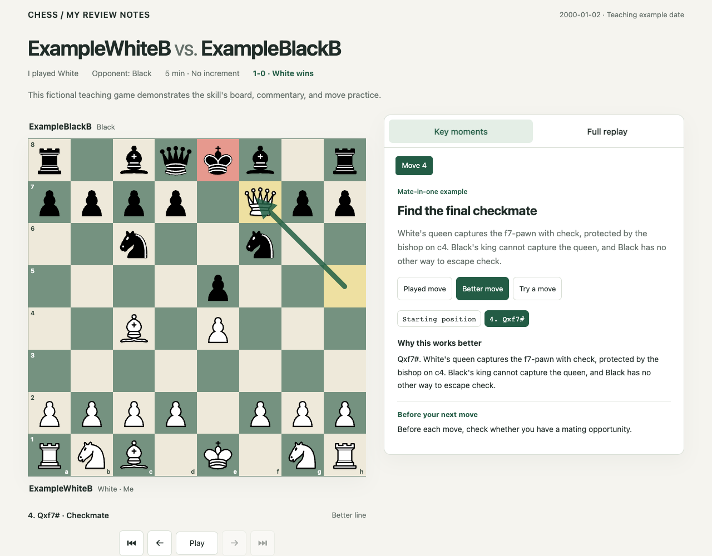

</details>

<details>
<summary><strong>Try it yourself</strong></summary>

**Try it yourself.** Make a move from the real position before revealing the answer. The page checks legality, recognizes verified alternatives and offers hints.

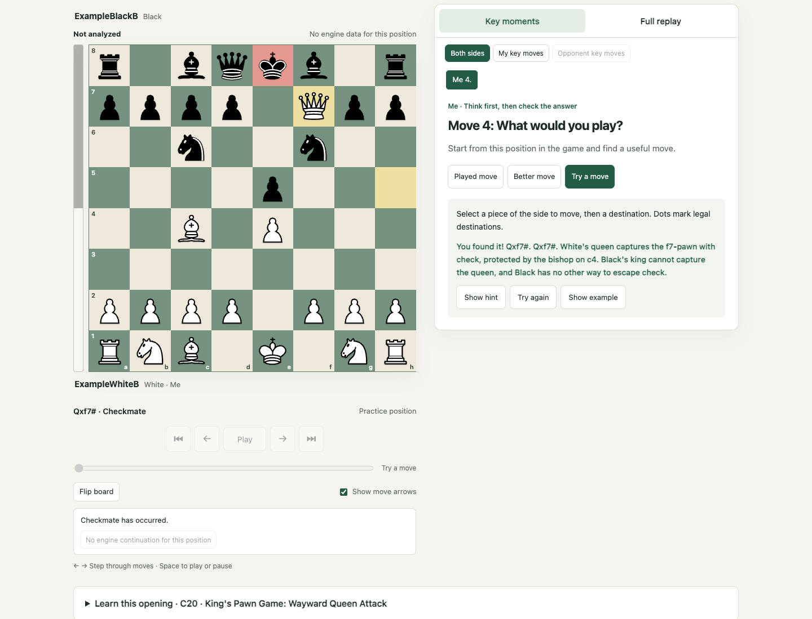

</details>

<details>
<summary><strong>Full-game replay</strong></summary>

**Replay the whole game.** Step forward or backward, autoplay, flip the board and download PGN.

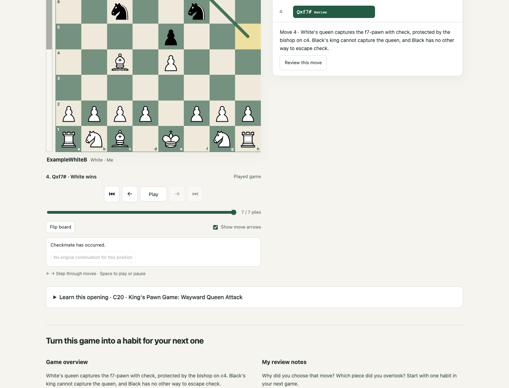

</details>

<details>
<summary><strong>Review archive</strong></summary>

**Keep a review archive.** Search opponents, filter by color and open every interactive review from one page.

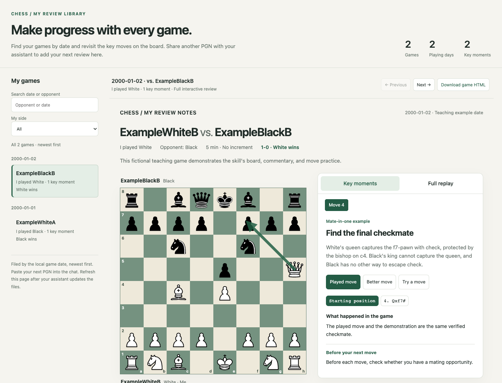

</details>

<details>
<summary><strong>Mobile and offline access</strong></summary>

**Use it on your phone.** Each review is a standalone HTML file you can open offline.

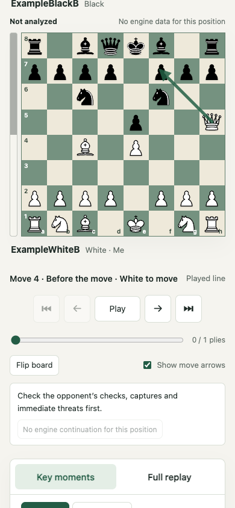

</details>

*Screenshots use fictional teaching games and the public historical Opera Game, not private user records.*

### 2. Common-leaks analysis

**Find mistakes that keep returning.** Group similar decisions across games and revisit each position. One occurrence is a “New finding”; at least two different games are needed for a repeated pattern.

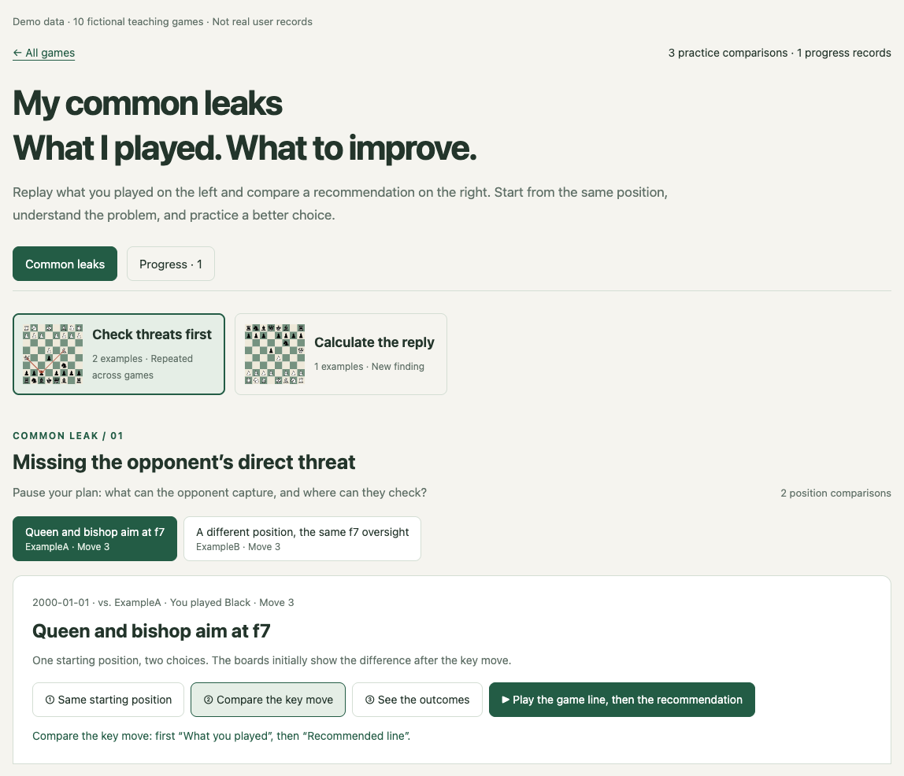

**Actual vs. suggested, side by side.** Two boards start from the same position. Play, pause and step through each line, with arrows and short captions showing what happened and what could change.

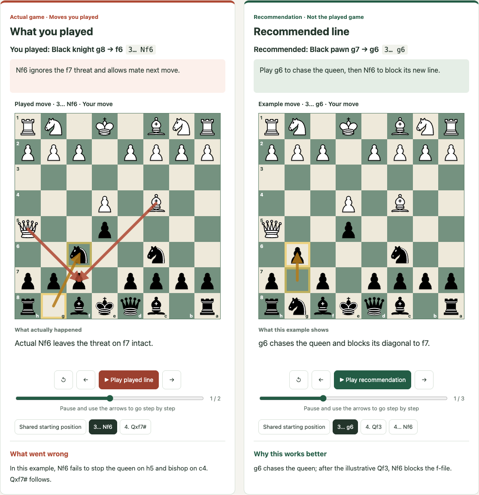

Opt in after at least **10 distinct completed interactive reviews**. Downloaded PGNs alone do not count. Later reviews add examples to existing groups or introduce new findings.

### 3. Progress analysis

**See what you are doing better.** A separate Progress tab records real good moves and, when comparable evidence exists, earlier/later examples. One success does not mean a recurring mistake is permanently fixed.

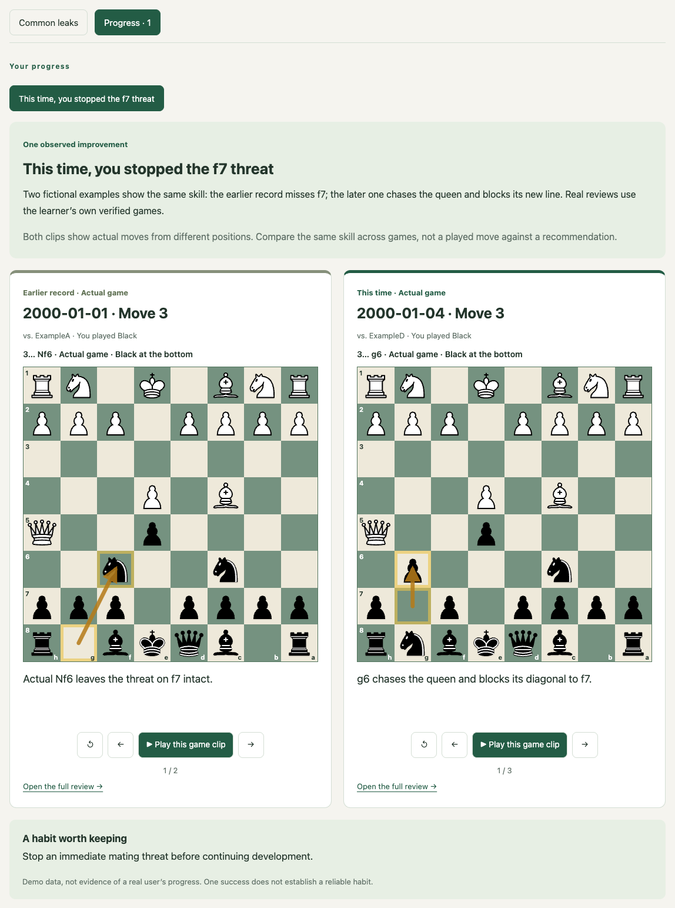

*Common-leaks and progress screenshots use fictional teaching games. Your archive uses your own verified games.*

## How does it compare?

| | Text-only ChatGPT, without chess tools | Chess.com / Lichess and similar tools | Chess Review Open |
|---|---|---|---|
| Understand the problem | Ask follow-up questions; positions and lines are mainly explained in text. | Explore evaluations, variations and mistakes on a board; some features include coaching explanations. | Selected teaching moments with plain English, arrows and actual/suggested comparisons. |
| Verify moves | Text alone provides no rules or engine guarantee. | Analyze with chess engines. | Validate moves with scripts, check key positions with Stockfish, then write explanations. |
| Practice | Discuss candidate moves; text chat alone is not an interactive board. | Try moves on analysis boards and use mistake-retry exercises. | Try your own key positions with hints, then compare actual and suggested lines. |

Chess platforms also offer explanations and exercises, such as [Chess.com Game Review](https://support.chess.com/en/articles/10328363-how-do-i-use-game-review-on-the-app) and [Lichess mistake practice](https://lichess.org/page/blind-mode-tutorial). This plugin brings **individual reviews, recurring mistakes and progress** into an editable archive you can keep offline.

### What can you learn from a review?

| Your question | What the review shows |
|---|---|
| What went wrong? | Specific pieces, squares, threats and consequences. |
| What could I play next time? | A suggested line from the same position, plus hands-on practice. |
| Which opening did I play? | Its name, matched position, a plan for this game and study links. |
| Which mistakes keep returning? | Related examples from different games, replayed together. |
| Am I improving? | Actual good moves and evidence-based comparisons. |

## How it works

```text
Chess.com username / pasted PGN → validate every move
→ analyze with bundled Stockfish
→ AI assistant selects teaching moments and writes English explanations
→ generate and check standalone HTML → update the archive
→ if enabled, add common-leak examples and progress evidence
```

The assistant writes the explanations using engine evidence; the engine does not generate the coaching text. Stockfish runs locally during analysis. The finished page needs no engine and makes no automatic network requests; opening an external study link visits that site. The skill has no server of its own. Your AI provider’s settings still apply when its assistant reads games and writes explanations.

## Input and output

**Input:** Chess.com username, PGN text, `.pgn` file or a clear scoresheet screenshot. If your side cannot be determined from the username, specify White or Black.

**Output:** Offline HTML in the user’s local `chess-reviews/` folder by default. Nothing is automatically uploaded to this source repository or the author’s website. Publishing requires a separate request and the user’s own hosting destination.

- `DATE_Opponent.html`: interactive game review.
- `DATE_Opponent.pgn`: normalized game for other chess software.
- `index.html`: the archive, updated after new reviews.
- `common-leaks.html`: the evolving common-leaks and progress archive, once enabled.

Personal notes remain in the current browser and can be exported; they do not sync between devices automatically. The username and feature preferences are saved locally. Personal games are not submitted as plugin examples.

## Structure

```text
plugins/chess-review-en/
  .codex-plugin/plugin.json
  skills/
    chess-review-open-en/     # Individual reviews; shared tools, templates and engine
    chess-common-leaks-en/    # Cross-game patterns and incremental updates
```

Installation details depend on your assistant. See the [runtime workflow](plugins/chess-review-en/skills/chess-review-open-en/references/workflow.md), [analytics definitions](plugins/chess-review-en/skills/chess-review-open-en/references/analytics.md) and [common-leaks format](plugins/chess-review-en/skills/chess-review-open-en/references/common-leaks.md).

## License

This project’s own scripts, templates, documentation and examples use [PolyForm Noncommercial 1.0.0](LICENSE): free to use, modify and share for **noncommercial purposes**, including personal learning, hobbies, teaching and nonprofit use. For commercial use, contact Mission Nine Lab Inc. at [info@mission9lab.com](mailto:info@mission9lab.com) for written permission.

Bundled Stockfish, separately installed python-chess and the chess-piece artwork retain their own third-party licenses. The noncommercial restriction does not apply to those components. See [third-party notices](plugins/chess-review-en/skills/chess-review-open-en/NOTICE.md).
